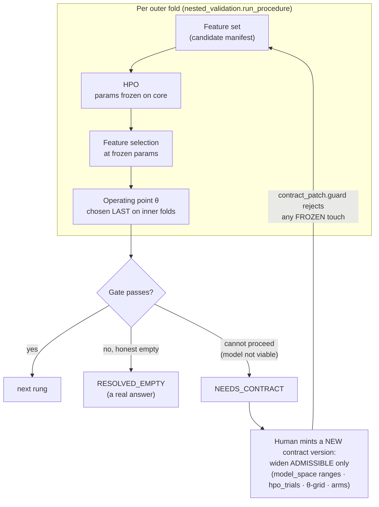

# Calibration configurables — the catalog of tunable numbers

Every number in this project is one of four kinds, and the difference is the whole discipline. This
file is the **catalog**: each configurable, its **range** (most are ranges, not one hard value), whether
it may change, *where* in the ladder it is calibrated, what it depends on, and — when a step cannot
calibrate — **which knob to widen**. For the ordered method itself see
[`FEATURE_DISCOVERY_METHODOLOGY.md`](FEATURE_DISCOVERY_METHODOLOGY.md); for the version-ladder mechanics
see [`ITERATIVE_CALIBRATION_LOOP.md`](ITERATIVE_CALIBRATION_LOOP.md).

## The four classes (this is why "everything is a range" is only half true)

Declared in `docs/FEATURE_DISCOVERY_METHODOLOGY.md:61-70`:

| Class | What it is | Range? | Where fixed |
|---|---|---|---|
| **Structural** | interval, label horizon, barriers, costs, embargo, the OOS ban | one frozen value | Rung 0 (`data_boundary`) |
| **Calibratable** | `gamma`, `min_child_weight`, θ-grid, block length, permutation count, HPO budget | **data-fitted range**, never one absolute number across assets | per-asset, from its own data |
| **Searched** | features, families, interactions, subsets | the *objects* the ladder looks for | Rungs 3→8 |
| **Methodology-governing** | viability floor, rotations, α, early-stop | the **proof standard** — frozen so a null result cannot be tuned away | contract kernel |

So: **Calibratable** numbers are the ranges that move with the data; **Methodology-governing** numbers
are deliberately frozen. Widening a Calibratable range is a legal hypothesis move; widening a
Methodology-governing number is a *different science* and is forbidden as an automatic action.

## Dependency chain + the widen loop

Widening is **forward-only along a human-authored ladder** (`engine/contract_patch.py:37-104`,
`config/iteration_loop_policy.json`). There is no automatic backtrack: a stuck rung returns
`NEEDS_CONTRACT` (`engine/states.py:135`) and asks a human to mint the next pre-authorized hypothesis.
The guard (`contract_patch.guard`) lets a patch enlarge only the ADMISSIBLE hypothesis space
(`model_space`, `operating_point`, `arms`, `rung_6_survivor_hpo`, `rung_7_interactions`) and rejects any
touch of the FROZEN proof standard — auto-widening the search is co-adaptation to the panel
(`FEATURE_DISCOVERY_METHODOLOGY.md:400-402`).

---

## Series A — HPO / XGB `model_space`

Two HPO regimes coexist; do not conflate them. **(A1)** the research Calibration-DAG uses **random
search** over a hessian-relative space; **(A2)** the sealed deployable pipeline uses **Optuna TPE**.

### A1 — research space (random search), `config/xgb_search_space_v2.json`, sampled by `scripts/model_viability.py:draw`

`gamma` and `min_child_weight` are **hessian-relative** — multiplied by the fold's own hessian H before
reaching XGBoost — so one `g_rel` means the same thing on every asset (`FEATURE_DISCOVERY_METHODOLOGY.md:99-102`).

| Configurable | Range | Class | Frozen? | Calibrated @ | Depends on | If it can't calibrate → widen |
|---|---|---|---|---|---|---|
| `hpo_trials` | **30** | Calibratable | ADMISSIBLE | Rung 1/3 | — | itself (ladder ex: →60) |
| `max_depth` | 2 – 5 (int) | Calibratable | ADMISSIBLE | Rung 1 (`draw`) | — | this space |
| `eta` | 0.02 – 0.3 (log) | Calibratable | ADMISSIBLE | Rung 1 | — | this space |
| `subsample` | 0.6 – 1.0 | Calibratable | ADMISSIBLE | Rung 1 | — | this space |
| `colsample_bytree` | 0.6 – 1.0 | Calibratable | ADMISSIBLE | Rung 1 | — | this space |
| `min_child_weight` | 0.002 – 0.05 **× H** | Calibratable | ADMISSIBLE | Rung 1 | fold hessian H | this space |
| `reg_lambda` | 0.5 – 5.0 | Calibratable | ADMISSIBLE | Rung 1 | — | this space |
| `reg_alpha` | 0.0 – 5.0 | Calibratable | ADMISSIBLE | Rung 1 | — | this space |
| `gamma` | 0.0 – 0.004 **× H** | Calibratable | ADMISSIBLE | Rung 1 | fold hessian H | this space |
| `n_estimators` | 40 – 300 (int) | Calibratable | ADMISSIBLE | Rung 1 | — | this space |
| rung 6 `budget_B` | **20** | Calibratable | ADMISSIBLE | Rung 6 | stable survivors | itself |
| booster fixed | `binary:logistic`, `aucpr`, `nthread=1` | Structural | FROZEN | — | — | — (determinism) |

### A2 — sealed Optuna, `xgb/src/config/xgboost_optuna_search_space.json`, driven by `pipeline.layer7_optuna`

| Configurable | Value | Class | Frozen? | Note |
|---|---|---|---|---|
| `N_TRIALS` | **80** | Calibratable | FROZEN (sealed epoch identity) | Optuna trials in the deployed model |
| sampler / pruner | TPE / MedianPruner warmup **2** | Methodology-governing | FROZEN | deterministic at seed |
| `cv_folds` | **4** | Structural | FROZEN | inner purged walk-forward |
| `gamma` / `min_child_weight` | 0.0–5.0 / 1.0–10.0 (**absolute**) | Calibratable | FROZEN | v1 space; *not comparable* with A1's hessian-relative ranges |

---

## Series B — Strategy / operating point θ

θ is a **grid**, not a value, and it is **candidate-dependent** (differs from core in 60% of configs),
so it is re-chosen inside every trading rung and applied to the confirmation/outer fold as a fixed level
(`config/contract/operating_space.json`, `scripts/nested_validation.py:117-150`).

| Configurable | Range / value | Class | Frozen? | Calibrated @ | Depends on | If it can't calibrate → widen |
|---|---|---|---|---|---|---|
| `operating_point.grid` (θ) | **[0.75, 0.82, 0.88, 0.92, 0.96, 0.99]** | Calibratable | ADMISSIBLE | Rung 2 (folded into 3-5) | candidate | alter/coarsen the grid (ladder ex: `[0.80,0.90,0.95]`) |
| sealed `theta` spectrum | [0.40 … 0.60] step 0.02 | Calibratable | FROZEN (sealed) | sealed L8 | — | — |
| `min_oof_trades` | **8** | Methodology-governing | FROZEN | Rung 3-5 | — | — (a floor, not a knob) |
| kelly `lambda` | [0.5, 1.0] (inert under all-in) | Calibratable | FROZEN | sealed L8 | `CAPITAL_MODE` | — |
| `H` (label horizon) | **24** | Structural | FROZEN | Rung 0 | — | — (moving it is a *new problem*) |
| triple-barrier TP / SL | 2.0 / 1.0 | Structural | FROZEN | Rung 0 | — | — |
| costs (commission / slippage) | 1 / 2 bps | Structural | FROZEN | Rung 0 | — | — |
| `EMBARGO_BARS` | **35** | Structural | FROZEN | Rung 0 | — | — |
| `PURGE_CANDLES` | **24** | Structural | FROZEN | Rung 0 | — | — |
| `INITIAL_CAPITAL_USD` | 1000 | Structural | FROZEN | Rung 0 | — | — |

> **H = 24 is one number in four places** — label horizon, `data_boundary.label_horizon_bars`, the null
> `block_length.floor/value_bars`, and the Kelly payoff geometry all derive from it. Moving it invalidates
> labels, folds and the null at once.

---

## Series C — Features / OHLCV combinations (the *searched* objects)

A feature is a fixed combination of OHLCV over frozen windows/lags; the **search** is over which
families/candidates enter, not over the window literals (those are part of `recipe_hash`).

| Configurable | Range / value | Class | Frozen? | Calibrated @ | Depends on | If it can't calibrate → widen |
|---|---|---|---|---|---|---|
| candidate features | **45** (over 12 families) | Searched | ADMISSIBLE (editing the map = new epoch) | Rung 3-4 | — | add candidates / families |
| families | **12** | Searched | ADMISSIBLE | Rung 4 (hierarchical arm) | — | add a family |
| frozen 1h core | **17** ids (never searched) | Structural | FROZEN | Rung 0 | — | — (the baseline) |
| OHLCV windows / lags | lags {1,5,20}; MA {20,50}; vol {20},{6,12}; ATR {14}; RSI {14}; BB {20, k=2}; MACD {12,26,9} | Structural | FROZEN (feature identity → `recipe_hash`) | Rung 0 | — | — (a new literal is a new feature) |
| arms | flat / hierarchical | Searched | ADMISSIBLE | Rung 4 | — | add/alter an arm |

---

## Proof-standard gates — Methodology-governing, FROZEN, **not ranges, not widenable**

These are the numbers that decide *how much proof is enough*. The contract kernel
(`engine/contract_patch.py:FROZEN`) forbids any ladder patch from touching them; changing one is a new
science, done by hand, not a loop side-effect.

| Gate | Value | Rung | Source |
|---|---|---|---|
| viability floor | `split_nodes ≥ 20`, `pred_std ≥ 0.005` | 1 | `config/xgb_search_space_v2.json`, `config/contract/model_space.json` |
| acceptance | `min_rotations = 2`, `complexity_penalty = 0.004`, majority-positive | 4 | `config/contract/discovery_contract.json` |
| max-null | **M = 50**, **α = 0.10**, pass `b ≤ 4` (p_mc = (1+b)/51 ≤ 5/51), futility stop at `b = 5` | 5 | `config/contract/multiplicity_contract.json` |
| block length | rule `L_block = max(H, L_dependency)` → **24**, `max_block_fraction_of_fold = 0.25`, sensitivity `[L, 2L]` | 5 | `multiplicity_contract.json:block_length` |
| rung-6 own-null | **M = 50**, `α = 0.10` (= `max_null.alpha`), retain iff `b ≤ floor(α·(M+1)−1) = 4` | 6 | `config/contract/discovery_contract.json:rung_6_survivor_hpo` |

> **α = 0.10 is one lab constant**, shared by `max_null.alpha` and `rung_6.own_null.alpha`; the pass-count
> bound `b` is *derived* from α and M, never hard-coded — the old fixed `b ≤ 4` applied at M = 20 (admitting
> p = 5/21 = 0.238) was the bug corrected by raising rung 6 to M = 50, where the derivation gives `b ≤ 4`
> again (p = 5/51 = 0.098) and the headline stays `26→11→9→2` on the sharper test.

---

## The widen protocol — which knob when a rung yields nothing

A negative rung is either an honest empty answer (`RESOLVED_EMPTY`) or a "cannot proceed" that asks for a
wider hypothesis (`NEEDS_CONTRACT`). Only the second widens, and only the ADMISSIBLE space.

| Rung yields nothing | State | Widen-target (next contract version) |
|---|---|---|
| 1 — no viable model | `NEEDS_CONTRACT` | `model_space` ranges / `hpo_trials` — **never** the viability floor |
| 3 — no marginal candidate | `RESOLVED_EMPTY` (or widen) | feature families / candidates, or the θ-grid |
| 4 — no confirmed feature | `RESOLVED_EMPTY` (or widen) | θ-grid / arms |
| 5 — no stable survivor across nulls | `RESOLVED_EMPTY` | — the null **is** the proof standard; a negative is the result, not a knob to widen |
| 6 — retained = 0 | `RESOLVED` | — a valid, complete outcome |

Rule of thumb: **widen a range only where the object being widened is a hypothesis (ADMISSIBLE), never
where it is the standard of proof (FROZEN).** Each widen is a new, hand-authored, self-consistent frozen
contract version — the ladder advances forward; it never loosens a prior rung's proof standard.
