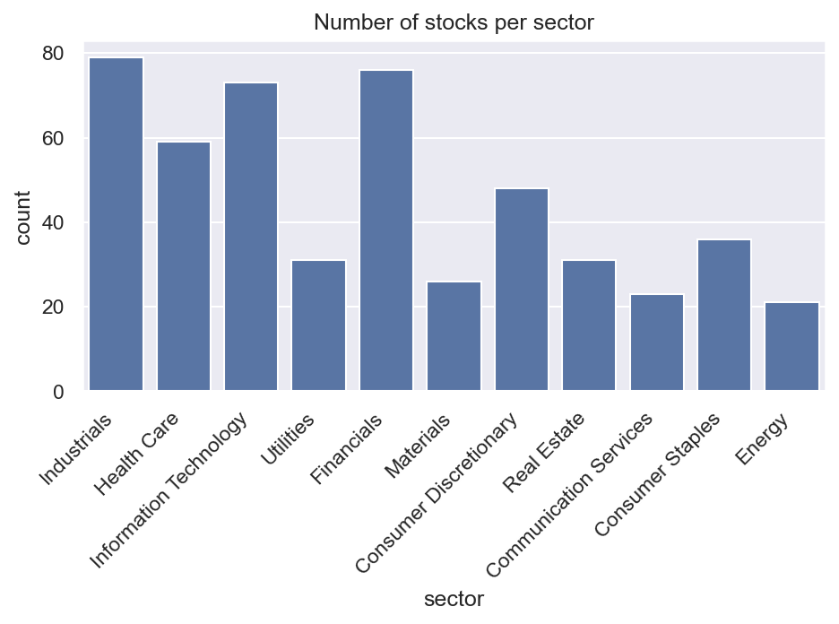
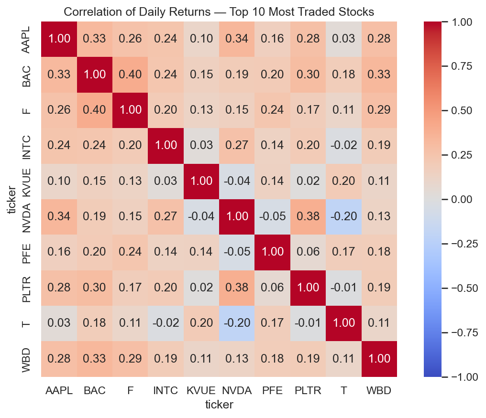

\newpage

# Executive Summary

The **Stock Portfolio Recommender** is a beginner-friendly tool that turns a short
questionnaire about an investor (experience, time horizon, loss tolerance, monthly
budget, sector preferences) into a small, diversified portfolio of 5–10 stocks
picked from the S&P 500, accompanied by the risk metrics that justify each pick.

This document is the **single growing report** for the project. It is updated at
each Liora milestone:

| Milestone     | Deadline      | Sections covered             | Status        |
| ------------- | ------------- | ---------------------------- | ------------- |
| Rendering 1   | 2026-06-03    | §2 – §7                      | **Delivered** |
| Rendering 2   | 2026-07-01    | §8 – §9                      | Not started   |
| Final report  | 2026-07-08    | §1, §10 + revisions of all   | Not started   |

This first rendering documents how we acquired the dataset, what it
contains, the exploratory analysis we ran, the data-quality issues and biases we
found, and the pre-processing plan that turns the raw bars into an ML-ready table.
All figures and statistics are reproduced directly from the local
dataset by `reports/make_figures.py`.

> **Disclaimer:** This project is decision support for a beginner investor, **not**
> financial advice.

\newpage

# 1. Introduction

## 1.1 Context and motivation

A first-time investor who wants to hold individual stocks faces an awkward gap in
the tooling market. On one side sit broker advisory products that hide their logic
behind a paywall and a risk questionnaire that collapses every user into one of
three buckets ("aggressive / moderate / conservative"). On the other side sit free
online screeners that expose hundreds of filters but assume the user already speaks
the language of finance — beta, drawdown, Sharpe ratio — and offer no opinion about
where to start. The result is that the beginner either pays for an opaque
recommendation or is left to sort ~500 tickers alone. Our project targets exactly
this gap: a transparent, data-driven recommender that explains *why* each stock was
picked, in terms a beginner can follow.

## 1.2 Problem statement

Retail investors who want to pick individual stocks usually have to choose between
paying for a broker's recommendation or scrolling through hundreds of tickers in an
online screener with no idea where to begin. We frame the recommendation problem in
three stages:

1. **Clustering** — group the stock universe by historical risk/return profile.
2. **Return ranking** — train a regression model to rank stocks *within* each cluster.
3. **Recommendation** — map the user's questionnaire to a target risk profile, pick the
   relevant clusters, and return top-*N* stocks per cluster, with a sector-concentration cap.

## 1.3 Scope and assumptions

- **Universe:** S&P 500 only (503 tickers in the current extract). DAX 40 deferred to a stretch goal.
- **Granularity:** daily OHLCV bars; ≈ 5–6 years of history on the Alpaca free IEX feed.
- **Currency:** USD only.
- **Horizon:** the recommender targets a 12-month-ahead expected return.
- **Out of scope:** intraday trading, options, fundamentals (P/E, EPS, dividend yield,
  any company financial statements), live execution, tax considerations.

## 1.4 Stakeholders and team

- **Team:** Gabriel Marchesan Almeida, Paweł Flak, Marcus Schürstedt.
- **Mentor:** Paul Grolier (Liora).
- **Audience for this report:** Liora jury (technical review, oral defense).

\newpage

# 2. Data Sources and Acquisition

## 2.1 Universe selection

We use the **S&P 500** as the initial universe — the 503 constituents (a handful of
companies carry two share classes) of the headline US large-cap index. The choice is
deliberate for a first iteration: a single currency (USD), a single primary market
and exchange calendar, and homogeneous accounting and disclosure standards remove a
large class of cross-market confounders before any modelling begins. The natural
alternative, the German **DAX 40**, was dropped from the working scope because our
selected data provider does not cover it on the free tier; the methodology is
market-agnostic, so DAX 40 can be re-added later through a second provider as a
stretch goal.

The constituent list is scraped from the Wikipedia "List of S&P 500 companies" page,
which also supplies each company's GICS sector and sub-industry. We acknowledge the
**survivorship bias** this introduces — the list reflects *today's* members, not the
historical index — and discuss mitigation below.

## 2.2 Data providers evaluated

| Provider | Role  | Status                                    |
| -------- | ----- | ----------------------------------------- |
| yfinance | OHLCV | **Rejected**                              |
| Alpaca   | OHLCV | **Selected** (mentor-approved) |

The project is intentionally **price-only** — no fundamentals, no risk-free rate, no offline
backup feed. Every feature engineered downstream (returns, volatility, beta, drawdown,
momentum, Sharpe with `rf = 0`) is derived from Alpaca OHLCV.

## 2.3 Why we abandoned yfinance (documented failed approach)

Our first data layer used **yfinance**, the open-source Python wrapper around an
unofficial Yahoo Finance endpoint. It let us stand up `fetch_data.py` quickly and
pull both S&P 500 and DAX 40 history, so we could prioritise the ML work over data
plumbing. In review, two problems made it unsuitable as the project's foundation:

- **Reliability / governance.** yfinance scrapes an undocumented endpoint with no
  service guarantee — it is fragile to rate limits, IP bans and silent schema
  changes, and it is not an accepted data source for back-testing platforms such as
  QuantConnect, which our recommendation engine will likely need later.
- **Validation.** Paweł built a side-by-side comparison (`data provider choose.html`)
  of Yahoo Finance vs. Alpaca on overlapping (ticker, date) pairs and found
  **≈ 99.5 % agreement** (median absolute relative difference ≈ 0.000 %). The worst
  tail of disagreements traced to split / listing differences rather than data
  corruption — i.e. the two feeds agree on the underlying prices, but Alpaca is the
  better-governed source of the two.

We therefore migrated to **Alpaca** (2026-05-21 → 2026-05-24): an officially
supported REST API with validated fields, a batched bars endpoint and a first-party
SDK (`alpaca-py`). The one real cost of the switch is coverage — Alpaca's free tier
does **not** include the DAX 40 — which is the direct reason for the universe
reduction. Paul approved Alpaca at the mentor meeting. Per his
guidance, this migration is recorded here as one of the **failed approaches** the
final report must document.

## 2.4 Alpaca free IEX feed — capabilities and limits

- **Feed:** IEX (≈ 2–3 % of US consolidated volume); acceptable for **daily**
  aggregates, but IEX volume understates true market activity — a limitation we
  carry forward, not a defect.
- **History depth:** in our extract the data spans **2017-11-15 → 2026-05-22**, but
  coverage is **not uniform** — most symbols only have continuous daily bars from
  mid-2020 onward on the free feed (SIP, the consolidated feed with deeper history,
  is paid).
- **Per-symbol caveat:** start dates differ by symbol. New entrants — `SNDK`
  (320 trading days), `PSKY` (200) and `Q` (139) — have well under two years of
  history. The per-ticker availability map is given below.
- **Adjustments:** bars are requested with `adjustment='all'`, so splits and
  dividends are folded into `adj_close`, the column we use for all return work.

## 2.5 Acquisition pipeline (`fetch_data.py`)

Acquisition is a single reproducible CLI, `fetch_data.py`, built on `alpaca-py`. It
reads the scraped ticker list, then for each batch of symbols requests **two**
passes from Alpaca's daily bars endpoint — `adjustment='raw'` for the unmodified
OHLCV and `adjustment='all'` for the adjusted close — and merges them on
`(date, ticker)`. Key flags: `--years` (history window, default 10), `--batch-size`
(symbols per request, default 1) and `--limit` (cap the ticker count for smoke
tests). Failed symbols are retried individually and any survivors are written to
`failed_tickers.csv`; the merged frame is de-duplicated on `(date, ticker)` and
sorted before being written to `data/`.

The canonical run (**2026-05-24**) produced **503 / 503 tickers with 0 failures and
726,018 price rows**, materialised as `prices_long.csv` (long format),
`prices_close_wide.csv` (a date × ticker pivot of `adj_close`) and `tickers.csv`
(metadata). These files are audited in the next section.

\newpage

# 3. Data Audit

The full automated audit lives in `DATA_AUDIT.md`; this section summarises it. All
counts below were re-verified against the local CSVs while preparing this report.

## 3.1 Datasets and schemas

| File                              | Rows    | Columns                          | Notes                         |
| --------------------------------- | ------- | -------------------------------- | ----------------------------- |
| `tickers.csv`                     | 503     | ticker, name, sector, industry, index, country | Wikipedia → enriched          |
| `prices_long.csv`                 | 726,018 | ticker, date, open, high, low, close, adj\_close, volume | Long format for feature eng. |
| `prices_close_wide.csv`           | 1,723 × 503 | date × ticker (adj\_close)   | Wide format for correlations |
| `failed_tickers.csv`              | 0       | ticker, reason                   | Empty after the last run     |

The price panel is **unbalanced**: 503 distinct symbols across 1,723 trading dates,
but not every symbol trades on every date (listing-date heterogeneity).

## 3.2 Data dictionary

**`tickers.csv` (metadata, 503 rows, 0 % missing):**

| Column     | Type   | Cat./Quant. | Notes |
| ---------- | ------ | ----------- | ----- |
| `ticker`   | string | categorical (503) | Primary key; Alpaca dot notation for share classes (`BRK.B`, `BF.B`). |
| `name`     | string | categorical (503) | Display only; not a model feature. |
| `sector`   | string | categorical (11)  | GICS sector; drives the ≤ 30 % sector cap. |
| `industry` | string | categorical (127) | GICS sub-industry; high cardinality → target/grouped encoding. |
| `index`    | string | categorical (1)   | Constant `SP500`; kept for future DAX 40 schema compatibility. |
| `country`  | string | categorical (1)   | Constant `US`. |

**`prices_long.csv` (daily OHLCV, 726,018 rows, 0 % missing):** `date` (1,723
distinct sessions, no weekends), `ticker` (FK → `tickers.csv`), `open` / `high` /
`low` / `close` (raw, unadjusted), `adj_close` (split/dividend-adjusted — **use this
for returns**) and `volume` (IEX shares). Raw `close` has mean 202.42, median 116.77
and max 9,933.51 USD; `adj_close` differs from `close` on **82.1 %** of rows
(mean absolute difference ≈ 33.1 USD), exactly as expected after corporate actions.

## 3.3 Completeness and missingness

There is **no random missingness**: every column is 0.0 % missing, there are **0**
duplicate `(date, ticker)` pairs, **0** OHLC-logic violations (`high < low`, prices
outside the open/close range) and **0** weekend rows. The metadata↔price join is a
100 % match on `ticker`.

What the dataset *does* have is **structural** missingness — gaps where a symbol was
not yet listed. History length per symbol ranges from **139 to 1,716 trading days**
(median **1,461**, mean 1,443). About 484 symbols begin on or after 2020-07-01 (IEX
free-feed coverage), a few reach back to 2017, and three recent S&P 500 entrants are
much shorter: `SNDK` (320 d), `PSKY` (200 d) and `Q` (139 d). Feature windows must
therefore be aligned per symbol against each ticker's first valid date — treating the
panel as balanced would silently fabricate pre-listing history.

\newpage

# 4. Exploratory Data Analysis

This section satisfies the Liora **Step 1** requirement: *"at least 5 relevant
visualizations, each with a precise commentary providing a business opinion and
validated by data manipulation or a statistical test."* We deliver **six** — the
same six approved by the mentor. Each figure below is regenerated from
the local data by `reports/make_figures.py`, which also computes the supporting
statistics referenced in the commentary.

## 4.1 Number of stocks per sector

{ width=80% }

**What it shows.** The 503 constituents split across 11 GICS sectors, from
Industrials (79), Financials (76) and Information Technology (73) at the top down to
Communication Services (23) and Energy (21).

**Business commentary.** The index is not balanced by sector, so a naïve
"pick the best names" recommender would drift heavily into Industrials / Financials /
Tech. This is the direct justification for the **≤ 30 % per-sector cap** at
recommendation time — and that cap is most likely to bind for tech-tilted
(aggressive) profiles.

## 4.2 Mean daily volume per stock

{ width=62% }

**What it shows.** One mean-daily-volume value per stock (503 points). The median is
≈ **104k shares/day**, but the distribution is strongly right-skewed, from ≈ 1.7k up
to ≈ 1.6M shares/day.

**Business commentary.** Liquidity spans three orders of magnitude. The recommender
should down-weight or flag the thinnest names — for a beginner, an illiquid pick is a
hidden cost (wide spreads, hard to exit) regardless of its risk/return profile.

## 4.3 Distribution of daily returns

{ width=85% }

**What it shows.** Daily returns are sharply peaked at ≈ 0 % with thin but very long
tails reaching beyond ±50 %.

**Business commentary.** Day-to-day, most stocks barely move; the action lives in the
tails. This validates the two-stage design — **cluster** by risk/return profile, then
**rank within** clusters — rather than trying to predict raw daily direction, which is
near-zero-centred noise.

## 4.4 Price line plot (anchor tickers)

{ width=85% }

**What it shows.** Five anchor tickers rebased to 100 at their first available bar.
Four established names (AAPL, MSFT, JPM, XOM) start on 2020-07-27 with ≈ 1,461–1,464
bars each; **SNDK starts only on 2025-02-13** with 320 bars and then rises steeply.

**Business commentary.** This is the survivorship-/ragged-history problem made
visible: the universe is not a uniform-quality panel, and a recent entrant on a short,
explosive run can dominate any naïve ranking. It motivates a **minimum-history rule**
for the clustering universe.

## 4.5 Correlation heatmap (top traded tickers)

{ width=72% }

**What it shows.** The return correlation matrix for the 10 most-traded names
(NVDA, INTC, F, BAC, AAPL, T, WBD, PFE, KVUE, PLTR).

**Business commentary.** Average pairwise correlation is **low and positive
(≈ 0.17)** — even among megacaps there is real diversification to harvest. This is the
quantitative basis for picking *across* low-correlation clusters rather than loading
one theme.

## 4.6 Risk vs. Return scatter

{ width=85% }

**What it shows.** One point per stock — annualised volatility (x) vs. annualised
return (y). The cloud trends up-and-to-the-right around the medians (vol ≈ 29.7 %,
return ≈ 16.1 %). **SNDK sits far in the top-right corner (≈ 98 % risk, ≈ 343 %
return)** as an extreme outlier.

**Business commentary.** Higher return comes bundled with higher risk — exactly the
trade-off the questionnaire must navigate. This plot is the visual map onto which the
user's risk tolerance is projected to choose target clusters.

\newpage

# 5. Identified Issues and Biases

## 5.1 Survivorship bias

The universe is **today's** S&P 500 (a Wikipedia snapshot at download time), so it is
biased toward winners — companies that were demoted or went bankrupt are absent, which
inflates the apparent average return of "the index". Any back-tested number in
Rendering 2 must be read with this caveat. Mitigation roadmap (per the mentor):
if time permits, reconstruct a historical-constituent panel from dated
Wikipedia revisions; otherwise we state the residual bias explicitly as a threat to
validity.

## 5.2 Outliers — the SNDK case (documented failed-pure-drop)

`SNDK` surfaces on the risk/return scatter at **≈ 343 % annualised return and
≈ 98 % annualised volatility**, but it has only **320 trading days** of history
(first bar 2025-02-13). The instinct is to drop it. Per the mentor we do
**not** drop outliers blindly: we plan a **with-vs.-without-outlier** modelling
comparison and report the measured impact. SNDK is the standing example of this class
of recent, high-variance entrants.

## 5.3 Ragged histories (new S&P 500 entrants)

The team's early assumption that all 503 tickers share uniform data quality was
**wrong** (per the mentor). History length runs from 139 to 1,716 days,
and three names — `SNDK` (320 d), `PSKY` (200 d), `Q` (139 d) — fall well under two
years. We will impose a **minimum-history cutoff** (candidate: ≥ 3 years, ≈ 756 trading
days) for the clustering universe so that volatility / beta / drawdown features are
estimated on enough data to be meaningful; short-history names can still be scored by
the ranking model but are flagged.

## 5.4 Single-market / single-currency scope

Dropping the DAX 40 narrows every empirical conclusion to **USD equities**. The
methodology generalises to other markets, but the fitted clusters and back-tested
numbers do not — we present them as US-large-cap results, not universal ones.

## 5.5 Look-ahead leakage

Because the metadata (sector/industry) reflects *current* GICS labels and the
adjusted prices fold in *all* historical corporate actions, careless feature
construction can leak future information into the past. Our discipline: features at
time *t* use only data available at *t*, and cross-validation is **`TimeSeriesSplit`,
never random k-fold**. This is a design rule for Rendering 2, stated here
so the EDA choices that feed it are on record.

\newpage

# 6. Data Manipulation Performed during EDA

The manipulations below are the ones run **during exploration**; the heavier
pre-processing pipeline is the subject of the next section. They are implemented in `src/data_loader.py` and
`src/plots.py` and are fully reproducible from the raw CSVs via
`reports/make_figures.py`:

- **Adjusted-close return series.** `data_loader.load_prices()` sorts by
  `(ticker, date)` and computes `daily_return = adj_close.pct_change()` *within each
  ticker* (the `groupby` prevents returns from bleeding across symbol boundaries).
- **Per-ticker aggregation.** Mean daily volume per stock and annualised
  return / volatility per stock (`mean·252`, `std·√252`) are `groupby('ticker')`
  reductions on the long frame.
- **Wide pivot for correlations.** We pivot `(date × ticker)` on `daily_return`
  for the most-traded names and drops dates with any missing member before computing
  the correlation matrix — so the matrix is built on a common 765-day window.
- **Metadata join.** Sector/industry are joined from `tickers.csv` on `ticker` for the
  sector plot and for the future sector-cap logic.

Each figure in this section is produced by exactly one of these paths, which keeps the report
reproducible end-to-end from the three source CSVs.

\newpage

# 7. Pre-processing and Feature Engineering

This section satisfies the Liora **Step 2** requirement. It defines the ML-ready
end-state and the cleaning / encoding / feature plan; the engineered table is built
and consumed in Rendering 2.

## 7.1 End-state definition

The dataset emerging from this section must be **ML-ready**:

- Fully numerical (no string columns).
- No NaNs (or NaNs deliberately preserved with a documented downstream handler).
- One row per (ticker, date) for time-series modelling, plus a wide per-ticker
  feature matrix for clustering.
- Split-ready: indices that the modelling code can pass directly to
  `TimeSeriesSplit`.

## 7.2 Cleaning rules

Driven by the findings above:

- **Fix the `low = 0` print** (AT&T, 2021-06-11): the other OHLC fields that day are
  ≈ 29.35, so the row is repaired (or dropped) rather than left to poison volatility
  features.
- **Flag the 60 raw daily moves > ±50 %** for review; most are split artefacts that
  `adj_close` already handles, so returns are built from `adj_close`, not `close`.
- **De-duplicate** `(ticker, date)` rows (already 0 in the current pull, enforced as a
  guard) and track a stable `ticker_id` so renames / class changes don't fragment a
  series.

## 7.3 Missing-value strategy (per column)

| Column                  | Missingness pattern | Strategy                                                         |
| ----------------------- | ------------------- | ---------------------------------------------------------------- |
| `open` / `high` / `low` / `close` | Trading halts | Forward-fill within ticker, max 3 days; else drop                |
| `volume`                | Holiday / zero-volume bars | `0` + indicator column                                    |
| `adj_close`             | Pre-listing bars    | Left blank; ticker dropped if first-listing < min-history cutoff |
| `sector` / `industry`   | Unmapped tickers    | Manual fix via override CSV                                      |

Because the only missingness is **structural** (pre-listing gaps), the key rule
is the per-ticker window alignment plus the min-history cutoff above — not generic
imputation.

## 7.4 Categorical encoding

Per the mentor, encoding is done **explicitly** even for models that can
ingest categories natively:

| Variable          | Cardinality | Tree-based models | Linear models |
| ----------------- | ----------- | ----------------- | ------------- |
| `sector` (11)     | low         | label encoding    | one-hot       |
| `industry` (127)  | high        | target encoding (fit inside CV folds) | hashing / grouped |
| `index` (1)       | trivial     | drop              | drop          |

Target encoding for `industry` is fit **inside** each CV fold to avoid leakage.

## 7.5 Derived features

Planned feature set (computed per ticker, windows in trading days), all derived from
`adj_close` / `volume`:

- `ret_1d`, `ret_5d`, `ret_21d`, `ret_252d` — log-returns over increasing horizons.
- `vol_21d`, `vol_252d` — rolling annualised volatility.
- `sharpe_252d` — annualised, computed with `rf = 0` (no external risk-free feed in scope).
- `beta_252d` — vs. an equal-weight market proxy built from the universe.
- `max_drawdown_252d` — worst peak-to-trough over the trailing year.
- `momentum_12_1` — 12-month return excluding the most recent month.
- `amihud_illiq` — illiquidity proxy (|return| / dollar volume), on the log scale.

## 7.6 Outlier policy (with-vs.-without comparison)

Per the mentor, we **do not drop outliers blindly**. Instead, we will:

1. Define an outlier flag (e.g. `|z-score| > 4` on annualised return).
2. Train all downstream models **twice** — once with the flagged rows, once without.
3. Report Δ-metric (R², RMSE, ranking-IC) and let the data decide.

This is the standing protocol for the **SNDK-class** tickers introduced earlier.

## 7.7 Train / validation / test split

A strictly **time-based** split (no shuffling): train on the earliest window,
validate on the next, test on the most recent — with `TimeSeriesSplit` (5 folds)
*inside* the training period and never random k-fold, so no future bar ever informs a
past prediction. Exact cut dates are fixed in Rendering 2 once the feature
table is materialised.

\newpage

# 8. Modeling [PLACEHOLDER — Rendering 2, due 2026-07-01]

> *This section will be filled in for the Rendering 2 submission.*

<!--
  Internal outline (NOT rendered to PDF — drives Sprint 2 work):

  8.1 Baseline models
    - Clustering baseline: K-Means on (vol, return, beta, max-DD, sector-OHE).
    - Ranking baseline: linear regression of 12-month forward return on the §7
      feature set.
    - Recommendation baseline: equal-weight top-N within each cluster.

  8.2 Optimisation and hyperparameter search
    - Search strategy (grid / random / Bayesian).
    - Search budget.
    - Time-aware CV with TimeSeriesSplit.

  8.3 Advanced models — bagging, boosting, Deep Learning
    - Random Forest (bagging) — per the mentor.
    - XGBoost (boosting) — per the mentor.
    - Neural network baseline (Keras MLP) — to be introduced after Paul's
      masterclass on 2026-06-11.

  8.4 Interpretability
    - Feature importance (XGBoost gain, permutation importance).
    - SHAP values on a held-out fold.
    - Cluster persona descriptions (sector profile, mean Sharpe).

  8.5 Hierarchical clustering comparison
    - Linkage choice (ward, average, complete).
    - Cophenetic correlation vs. K-Means inertia.
-->

\newpage

# 9. Results and Discussion [PLACEHOLDER — Rendering 2]

> *Numbers will be filled during Sprint 2.*

<!--
  Internal outline (NOT rendered to PDF):

  9.1 Clustering quality
    - Silhouette score, Davies–Bouldin, Calinski–Harabasz.
    - Cluster persona summaries.

  9.2 Ranking model performance
    - R², RMSE, ranking IC (information coefficient) on out-of-time test.
    - Comparison: linear baseline · Random Forest · XGBoost.
    - With-vs.-without outliers comparison table (per §7.6).

  9.3 Recommendation evaluation
    - Backtest Sharpe of the top-N portfolio vs. equal-weight S&P 500.
    - Sector-cap binding frequency.
    - Sensitivity to the user-questionnaire mapping.

  9.4 Threats to validity
    - Survivorship bias (§5.1) — quantify residual effect.
    - Out-of-time degradation.
    - Free-tier feed coverage gaps.
-->

\newpage

# 10. Conclusion and Opening [PLACEHOLDER — Final Report]

> *This section will be added in the final report (2026-07-08).*

<!--
  Internal outline (NOT rendered to PDF):

  - What we built, in two paragraphs.
  - What worked, what didn't, what we'd do differently.
  - Three concrete extensions:
      (a) DAX 40 via a second provider,
      (b) historical-constituent panel to remove survivorship bias,
      (c) paper-trading loop via Alpaca.
-->

\newpage

# Appendices

## A. Reproducibility

```bash
git clone <repo-url> && cd apr26_bds_int_stock_portfolio
python -m venv .venv && source .venv/bin/activate
pip install -r requirements.txt
cp .env.example .env.local   # add ALPACA_API_KEY / ALPACA_API_SECRET
python fetch_data.py                      # rebuild data/ from Alpaca (IEX)
python reports/make_figures.py            # regenerate figures + printed statistics
./reports/build_pdf.sh                    # rebuild this PDF
```

Every figure and statistic is produced by `reports/make_figures.py`; the
report carries no hand-entered numbers.

## B. Computing environment

Built and verified on macOS (Darwin 25.x), **Python 3.14**, with
`pandas 3.0`, `numpy 2.4`, `scipy 1.17`, `matplotlib 3.10` and `seaborn`; data access
via `alpaca-py`. The PDF is rendered with Pandoc + XeLaTeX using the Eisvogel
template (`reports/build_pdf.sh`). Exact versions are pinned in `requirements.txt`.

## C. Streamlit application

The exploratory dashboard (`app.py`) serves the six EDA figures interactively and is
the basis for the defense demo; the recommender pages are added in Rendering 2.

## D. Glossary

Adjusted close, log-return, annualised volatility, beta, max drawdown, Sharpe ratio,
IEX vs. SIP feed, survivorship bias, look-ahead leakage, `TimeSeriesSplit`. Full
definitions to be expanded for the final report.

## E. Bibliography

- Aroussi, R. — *[yfinance documentation](https://ranaroussi.github.io/yfinance/)*.
- López de Prado, M. (2018). *Advances in Financial Machine Learning*. Wiley.
- Alpaca Markets — *[Market Data API documentation](https://docs.alpaca.markets/)*.
- *(Add references progressively. Switch to a `.bib` file + CSL when count > 10.)*
